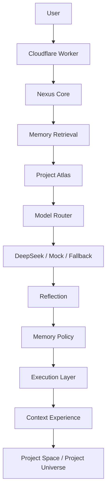

# Nexus AI

**AI Project Intelligence Space**

Connect ideas. Create possibilities.

Nexus AI is a project intelligence workspace that helps turn an early idea into
a structured project direction. It combines an agent layer, memory layer,
execution layer, and visual experience layer so a project can be understood,
refined, remembered, and explored.

Nexus is not designed as a generic chatbot. It is a space for understanding how
an idea becomes a project.

## Live Demo

Live demo:

[https://cyrilla-mist.github.io/nexus-ai/](https://cyrilla-mist.github.io/nexus-ai/)

The GitHub Pages demo is a static showcase. It uses preset demo data for a
campus sustainability project and does not call the Cloudflare Worker, DeepSeek,
or the runtime Memory Layer.

Use the demo to review the product direction:

- Project Space
- Project Overview
- Journey
- Context Map
- Project Universe / Star Map
- Action Navigator

To test the real AI prototype, run the Worker and frontend locally.

## Core Experience

Nexus guides a project through four visible experience steps:

1. Capture the initial idea.
2. Generate a structured project analysis with Project Atlas.
3. Preserve high-value project context through Memory.
4. Display the project as a navigable Project Space.

The current product experience includes:

- readable project profile and blueprint
- project stage tracking
- clarification questions
- next-action guidance
- Context Map data
- Star Map / Project Universe display
- retry-safe browser session handling
- Mock, DeepSeek, and Fallback model modes

## Architecture



The GitHub Pages demo does not execute this full backend chain. It presents a
static version of the experience for public viewing.

## Repository Structure

```text
atlas/       Project Atlas agent logic
core/        Nexus Core orchestration
memory/      Memory schema, retrieval, policy, and update foundation
execution/   Project state, milestone, task, and progress foundation
experience/  Read-only experience adapters and Context Map data
model/       Model router and DeepSeek client
worker/      Cloudflare Worker entrypoint
frontend/    Static HTML, CSS, and JavaScript interface
tests/       Node native tests and validation scripts
docs/        Architecture, design, and product planning documents
```

## Current Capabilities

- Nexus Core can orchestrate Project Atlas.
- Project Atlas can build structured project analysis.
- The model layer supports DeepSeek when configured.
- Mock Mode works without an API key.
- Fallback Mode protects the user experience when model output fails.
- Memory Retrieval can provide project context.
- Memory Policy filters what can be saved.
- Execution Layer can represent project stage, milestones, tasks, and progress.
- Context Experience converts internal state into display-ready structures.
- Frontend Project Space presents Overview, Journey, Context, Universe, and
  Action sections.

## Current Limitations

This repository is still an early prototype. Current limitations are explicit:

- GitHub Pages demo uses static preset data.
- Runtime Memory is process-local and not durable.
- Restarting the Worker clears in-memory state.
- Browser session progress is stored per tab with `sessionStorage`.
- There are no user accounts.
- There is no multi-user project system.
- There is no cloud-persistent project storage.
- DataHub is not connected.
- MCP is not connected.
- Multi-Atlas collaboration is not implemented.
- Project Universe is still being refined for readability and exploration.

## Local Development

Requirements:

- Node.js
- npm

Install dependencies:

```bash
npm install
```

Start the Cloudflare Worker:

```bash
npm run dev
```

The local Worker endpoint is:

```text
http://localhost:8787/api/nexus
```

Serve the static frontend in a second terminal:

```bash
npx --yes serve frontend -l 4173
```

Open:

```text
http://localhost:4173
```

Run checks:

```bash
npm test
npm run check
npm run verify:multiturn
```

Validate the Worker bundle without deploying:

```bash
npx wrangler deploy --dry-run
```

## DeepSeek Configuration

Mock Mode works without a DeepSeek key.

For local DeepSeek Mode, create `.dev.vars` from the example file and set:

```dotenv
DEEPSEEK_API_KEY=...
```

For Cloudflare production, store the key as a Worker secret:

```bash
npx wrangler secret put DEEPSEEK_API_KEY
```

Security rules:

- Do not commit `.dev.vars`.
- Do not put API keys in frontend code.
- Do not put API keys in GitHub.
- If no key is configured, Nexus should continue in Mock Mode.

## Roadmap

Planned directions:

- improve Project Universe readability and onboarding
- refine the Star Map as a true project exploration space
- add persistent project memory in a future storage layer
- explore DataHub Context Graph integration
- support multiple Atlas capabilities
- prepare stronger showcase and portfolio materials

These are future directions, not current shipped capabilities.

## License

MIT License.

Copyright (c) 2026 cyrilla-mist
