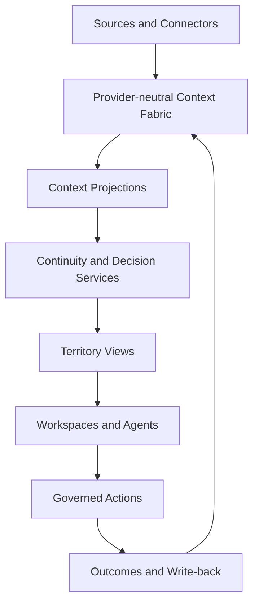

# Nexus Atlas

**Restore context. Trace decisions. Continue the work.**

Nexus Atlas is a **personal intelligence infrastructure** for maintaining continuity across long-running projects.

When work is interrupted, the files usually remain. The harder part is recovering the surrounding context: what changed, which decisions still hold, what evidence became stale, where agents disagree, and what action is safe to continue with.

Nexus turns that context into a traceable route that a person or agent can resume.

> **Canonical repository.** This is the long-term Nexus Atlas codebase. The August 2026 DataHub hackathon submission is preserved separately at [`cyrilla-mist/nexus-atlas-datahub-2026`](https://github.com/cyrilla-mist/nexus-atlas-datahub-2026).

## The Problem

Most AI assistants begin with the latest prompt. Long-running work needs more than that.

After a project has been inactive, a user may no longer know:

- what changed while the project was paused;
- which decisions are still valid;
- which evidence is outdated;
- why different agents recommended different directions;
- which actions are blocked by unresolved authority or governance;
- what should happen next without silently rewriting project history.

Nexus begins with the context that future work depends on.

## Core Experience

```text
Atlas Desk
  → Atlas Map
  → Territory Workspace
  → Context Inspector
  → Governed Action
  → Outcome and Context Write-back
```

### Atlas Desk

Surfaces projects and routes that currently need attention instead of opening with an empty chat box.

### Atlas Map

Shows a focused **Context Route** for the current task rather than attempting to visualize every record in the underlying graph.

### Territory Workspace

Projects the same Context Fabric into different kinds of work, including:

- Innovation
- Learning
- Research
- Creation
- Evaluation

### Context Inspector

Explains a record's source, state, relationships, governing rule, authority, and available actions.

### Confirmation Sheet

Requires explicit human approval before consequential context changes or external mutations.

## Context Fabric

Nexus uses provider-neutral primitives such as:

- Person
- Project
- Record
- Event
- Decision
- Goal
- Action
- AgentRun
- ExternalAssetRef
- Relationship
- Provenance and State

Identity, Knowledge, Memory, Decision, and Action Context are dynamic projections over the same fabric rather than isolated databases.

### Deterministic Continuity

Nexus separates established project state from model interpretation.

Rules can establish findings such as:

- meaningful changes;
- valid decisions;
- stale evidence;
- conflicts;
- blocked actions;
- missing ownership or governance metadata.

A model may explain established context, but it does not invent the underlying project state.

```text
Rules establish facts
  → model interprets context
  → user confirms consequential decisions
```

## Current Deep Scenario: Verity Re-entry

The most developed continuity scenario uses **Verity**, an AI-assisted project-material review product.

A user returns after an interruption. Nexus restores the known project state, identifies meaningful changes, preserves still-valid decisions, surfaces stale evidence and agent conflicts, and presents a governed continuation route.

The deterministic fixture establishes:

```text
4 meaningful changes
4 valid decisions
2 stale evidence records
1 agent conflict
1 missing owner
```

The scenario is intentionally evidence-oriented: recommendations do not become approved project direction simply because an agent or implementation branch produced them.

## DataHub Integration

Nexus can overlay governed external metadata from DataHub onto the project context without treating DataHub as the canonical store for the user's entire Context Fabric.

```text
Nexus Context Fabric
  project history · decisions · memories · goals · actions

DataHub
  governed assets · ownership · lineage · metadata state
```

The Verity integration includes governed dataset assets, ownership and lineage checks, a read-only source adapter, an isolated mutation path, explicit confirmation, and read-after-write verification.

A successful mutation response alone is not treated as proof. A repair is complete only after a fresh read verifies the intended state.

For the frozen competition implementation and submission links, see [`nexus-atlas-datahub-2026`](https://github.com/cyrilla-mist/nexus-atlas-datahub-2026).

## Architecture



External governed systems such as DataHub connect through source adapters rather than replacing the Context Fabric.

## Archive Cartography

Nexus uses a visual language called **Archive Cartography**.

The interface treats long-running work as a contemporary working atlas:

- landmarks represent important projects, goals, decisions, evidence, assets, and actions;
- routes represent stored relationships;
- annotations expose scope and provenance;
- broken routes show stale, conflicting, or blocked context;
- stamps represent verified governance states;
- the Inspector exposes evidence and authority.

The design deliberately avoids decorative neon graphs and science-fiction dashboards when those visuals do not correspond to real stored relationships.

## Repository Structure

```text
atlas/          earlier Project Atlas foundation
core/           Nexus orchestration foundation
memory/         memory schema, retrieval, and policy foundation
execution/      project state and action foundation
experience/     continuity providers and view-model logic
continuity/     deterministic scenarios and schemas
frontend/       Atlas and Continuity interface modules
datahub/        governed assets, readers, bridges, and ingestion
examples/       sample contracts and deterministic outputs
tests/          validation and test suites
scripts/        scenario assembly and source verification
docs/           architecture and product documentation
worker/         Cloudflare Worker prototype
atlas.html      Atlas shell
reentry.html    Continuity workspace
```

## Run the Fixture Demo

Requirements:

- Node.js
- npm
- Python 3

```bash
npm install
npm test
npm run check
npm run verify:verity-continuity
npm run verify:verity-datahub
npm run verify:verity-ingestion
python -m http.server 8000
```

Then open:

```text
http://localhost:8000/atlas.html
http://localhost:8000/reentry.html?scenario=verity#brief
```

The deterministic fixture is network-free and suitable for inspecting the product flow without relying on external services.

## Public Demo

- **Atlas:** https://cyrilla-mist.github.io/nexus-ai/atlas.html
- **Continuity workspace:** https://cyrilla-mist.github.io/nexus-ai/reentry.html?source=fixture&scenario=verity

The public GitHub Pages deployment uses fixture-backed data. Local external integrations require their own runtime configuration and should not be inferred from the static demo.

## Documentation

Key material is preserved in `docs/`, including:

- [Nexus Atlas Architecture Review v1.0](docs/Nexus-Atlas-Architecture-Review-v1.0.md)
- [DataHub Verity Asset Bridge](docs/Nexus-DataHub-Verity-Assets.md)
- [Architecture document index](docs/architecture/README.md)
- [中文产品讲解手册](docs/nexus-atlas-guide-zh.md)

## Status

Nexus Atlas is a long-term experimental product rather than an active hackathon submission.

The current repository preserves a substantial continuity architecture and the Verity re-entry implementation. Some deeper external-runtime paths still require environment-specific verification and should not be treated as complete unless their output has been captured.

## Direction

The long-term product direction remains:

```text
Restore Context
  → Continue the Work
  → Record the Outcome
  → Update Memory
```

Future work should strengthen the reusable Context Fabric and continuity flow rather than recreate competition-specific submission branches inside the canonical repository.

## Privacy and Security

Do not commit API keys, access tokens, `.dev.vars`, service-account files, MCP credentials, or private user identifiers.

The included Verity demonstration data is deterministic and synthetic; it is not intended to contain private production data or confidential project records.

## Development Disclosure

AI coding and documentation tools have been used during development. Product direction, scenario design, architecture, governance rules, implementation decisions, review, and final integration are directed and evaluated by the project author.

## License

Copyright 2026 cyrilla-mist.

Licensed under the [Apache License 2.0](LICENSE).
