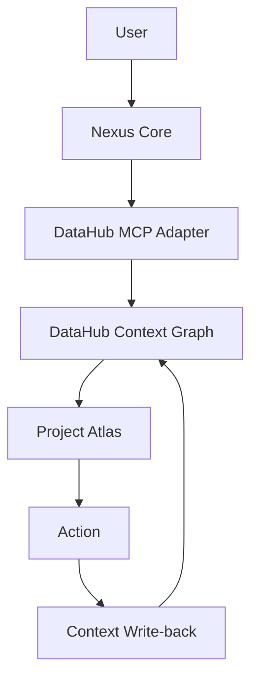

# Nexus AI × DataHub Integration

## 1. Goal

Nexus AI converts fragmented project context into a searchable, traceable, agent-readable Context Graph.

The v0.9.1 goal is to create a DataHub Context Graph foundation that can later support MCP-based retrieval and write-back. This phase does not connect Nexus Core, the Worker, or Project Atlas to DataHub at runtime.

## 2. Why DataHub

DataHub can serve as a context infrastructure layer for Nexus:

- **Context Registry:** store project context nodes as searchable metadata assets.
- **Relationship Graph:** represent semantic project relationships through lineage in the prototype.
- **Source Tracing:** preserve where a project context node came from.
- **Agent-readable Metadata:** expose structured project context to future MCP-enabled agents.
- **Knowledge Write-back:** provide a future target for confirmed decisions, tasks, and progress updates.

## 3. Architecture



The DataHub MCP Adapter is a next-stage integration target for v0.9.2. It is not wired into Nexus Core in v0.9.1.

## 4. Entity Mapping

This version uses existing DataHub Dataset entities as a Hackathon proof-of-concept mapping. These entities represent Nexus Context Nodes. They are not real database tables.

| Nexus concept | DataHub prototype entity | Notes |
| --- | --- | --- |
| Nexus Project | Dataset | Project context root |
| Problem | Dataset | Project problem context |
| Decision | Dataset | Confirmed or proposed decision context |
| Milestone | Dataset | Execution milestone context |
| Task | Dataset | Action context |
| Progress | Dataset | Confirmed progress context |

Platform:

```text
urn:li:dataPlatform:nexus
```

Environment:

```text
DEV
```

Example dataset URN:

```text
urn:li:dataset:(urn:li:dataPlatform:nexus,nexus.campus-low-carbon.project,DEV)
```

## 5. Relationship Mapping

Nexus relationships are mapped to DataHub lineage for the prototype.

Rule:

```text
Nexus relationship source -> DataHub upstream
Nexus relationship target -> DataHub downstream
```

Supported relationship examples:

| Nexus relation | DataHub prototype expression |
| --- | --- |
| addresses | Project upstream of Problem |
| supports | Decision upstream of Project |
| contains | Milestone upstream of Task |
| updates | Progress upstream of Project |

Lineage is used here to preserve Context Graph semantics in a reusable DataHub-native mechanism. It does not imply data pipeline execution.

## 6. Read Flow

In a later version, an MCP-enabled Nexus agent can read context through DataHub:

1. Search for the Nexus project asset.
2. Retrieve DatasetProperties for each context node.
3. Read `customProperties` such as node type, source, status, and context text.
4. Query lineage to reconstruct relationships.
5. Pass the retrieved context to Project Atlas.

## 7. Write-back Flow

Future Nexus write-back should only write high-value, policy-approved context:

- new confirmed Decision
- new Task
- Progress update
- source and confidence information

The current v0.9.1 scripts support explicit metadata apply, but Nexus Core does not automatically write to DataHub.

## 8. Current Status

Completed in v0.9.1:

- schema mapping
- sample graph
- ingestion script
- verification script
- MCP configuration sample
- DataHub integration documentation

Not completed in v0.9.1:

- Nexus Core MCP runtime
- Worker-to-DataHub connection
- production deployment
- authentication flow
- cloud persistence
- DataHub-backed project memory

## 9. Security

Security rules:

- tokens are provided only through environment variables or CLI arguments;
- tokens are never committed;
- tokens are never printed;
- dry-run is the default behavior;
- write operations require explicit `--apply`;
- sample metadata contains no user names, API keys, local paths, private accounts, or unsupported personal information.

## 10. Next Step

v0.9.2 should focus on the DataHub MCP Runtime Bridge:

```text
Nexus Core
-> DataHub MCP Adapter
-> DataHub Context Graph
-> Project Atlas context retrieval
```

That step should remain separate from this foundation so the metadata mapping can be verified before runtime integration.
