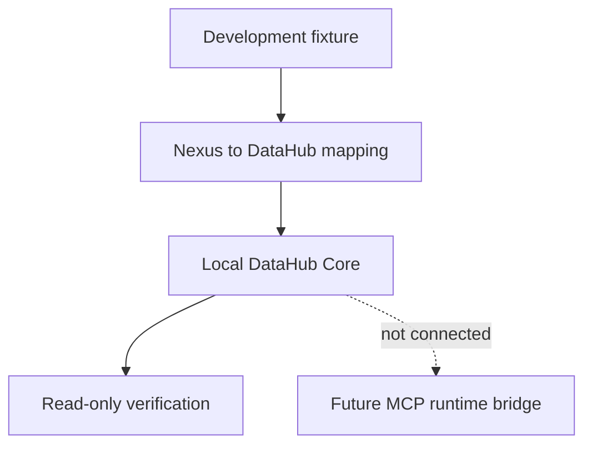

# Nexus AI × DataHub Integration

## 1. Goal

Nexus AI converts project context into a searchable, traceable, agent-readable Context Graph. The current foundation maps a bounded development fixture into DataHub and validates the mapping without connecting Nexus Core, the Worker, or Project Atlas to DataHub at runtime.

> The campus low-carbon project is a development fixture used only to verify DataHub ingestion, metadata properties, search, and lineage. It is not the final Nexus AI hackathon scenario.

## 2. Why DataHub

DataHub is evaluated as a future context infrastructure layer for registering project context as metadata assets, representing semantic relationships, preserving source/status metadata, and exposing structured context to a future read-only MCP bridge.

No final Devpost scenario, cloud persistence, account system, or production integration is claimed here.

## 3. Current Architecture Boundary



Nexus Core and Project Atlas remain outside the DataHub runtime in this version.

## 4. Entity Mapping

The prototype uses DataHub Dataset entities for Nexus Context Nodes. They are metadata assets, not database tables.

| Nexus concept | DataHub prototype entity | Purpose |
| --- | --- | --- |
| Nexus Project | Dataset | project context root |
| Problem | Dataset | problem context |
| Decision | Dataset | decision context |
| Milestone | Dataset | execution milestone |
| Task | Dataset | action context |
| Progress | Dataset | confirmed progress |

Project URN:

```text
urn:li:dataset:(urn:li:dataPlatform:nexus,nexus.campus-low-carbon.project,DEV)
```

## 5. Relationship Mapping

Nexus source maps to DataHub upstream and Nexus target maps to DataHub downstream. The prototype represents `addresses`, `supports`, `contains`, and `updates` through lineage. This preserves relationship direction and does not claim pipeline execution.

## 6. Runtime Evidence

Validated on 2026-07-29:

- DataHub Core quickstart image: `v1.5.0.6`
- DataHub CLI: `1.5.0.6+docker`
- GMS health check: successful
- fixture entities: 7
- fixture relationships: 5
- idempotent verification result: `PASS`

The verification was read-only and performed once after confirming the fixture had already been ingested. Detailed evidence is in `datahub/runtime/README.md`.

## 7. MCP Runtime Boundary

The official current self-hosted implementation is the Python package `mcp-server-datahub`, launched over stdio with:

```text
uvx mcp-server-datahub@latest
```

Configuration uses `DATAHUB_GMS_URL`, optional `DATAHUB_GMS_TOKEN`, and explicit mutation/document-writing disable flags. The verified local quickstart has authentication disabled, so the example omits a token.

Successful local verification used the official Python MCP server `mcp-server-datahub` `0.6.0` with Node `v24.18.1` and npm `11.16.0`. The server started over stdio and the smoke test completed MCP initialization, `tools/list`, `search`, `get_entities`, and `get_lineage` against the seven-entity, five-relationship development fixture.

The final output was `PASS: DataHub MCP read-only smoke test completed`. Mutation Tools, User Tools, and Data Quality Tools were disabled, and no mutation call was made.

## 8. Intended Read-only MCP Flow

The verified harness initializes stdio, requires the three read tools, rejects known mutation-tool exposure, searches for the fixture, retrieves the project entity, and retrieves one-hop lineage. No mutation call is part of the smoke test.

## 9. Future Write-back Boundary

Future write-back may include confirmed decisions, tasks, progress, source, and confidence only after Nexus Memory Policy approval. The current foundation does not implement automatic write-back.

## 10. Security

- tokens remain in environment variables;
- tokens and local absolute paths are never committed or printed;
- ingestion defaults to dry-run;
- writes require explicit `--apply`;
- MCP configuration disables mutation;
- the fixture contains no private account or secret data.

## 11. Next Step

The read-only MCP evidence is complete. Nexus Core integration, final Hackathon scenario design, and any write-back bridge remain separate future tasks and have not started.
